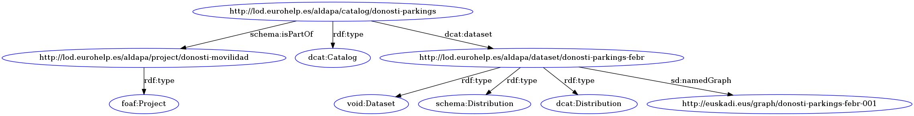

Getting Started
===============

## Example pipeline

The main usage of ALDAPA is to define a pipeline that converts a CSV to RDF, and pushes the RDF to a Triple Store. An example of such a pipeline is provided at [/src/main/java/es/eurohelp/lod/aldapa/impl/pipeline/ejiecalidaddelaire/EJIECalidadAire.java](/src/main/java/es/eurohelp/lod/aldapa/impl/pipeline/ejiecalidaddelaire/EJIECalidadAire.java): the pipeline takes a CSV describing air quality, downloaded from [Open Data Euskadi](http://opendata.euskadi.eus/catalogo/-/calidad-aire-en-euskadi-2017/), converts it with a bespoke parser, and stores the resulting RDF in an in-memory, temporary RDF4J store. The code reads as follows:

```
		// Load the configuration from file configuration.yml
		ConfigurationManager config = ConfigurationManager.getInstance("configuration.yml");
		
		// Create a manager with the configuration
		Manager manager = new Manager(config);
		
		// Add project
		String project_uri = manager.addProject("EuskadiMedioAmbiente");
		
		// Add catalog
		String catalog_uri = manager.addCatalog("CalidadAire", project_uri);
		
		// Add dataset
		String dataset_uri = manager.addDataset("Estaciones", catalog_uri);
		
		// Add namedGraph 
		String named_graph_uri = manager.addNamedGraph("Estaciones01", dataset_uri);
		
		// Add data to named graph
		manager.addDataToNamedGraph(named_graph_uri, "data/OpenDataEuskadiCalidadDelAire/estaciones.csv");
		
		// Flush backbone
		manager.flushGraph(null, "data/EuskadiMedioAmbienteMetadata.ttl");
		
		// Flush data from named graph
		manager.flushGraph(named_graph_uri, "data/EuskadiMedioAmbienteData.ttl");
		
```

(Note that other steps involving modification of the resulting RDF could be defined, like crawling, link discovery, quality checks, etc.).

## Backbone metadata

ALDAPA creates a "backbone" RDF into which metadata triples can be added:

* Project
 * Catalog
  * Dataset
   * NamedGraph
   
A Project can have different Catalogs, but a Catalog can only be related to one project: the same principle applies to the whole hierarchy.     

Yo can each separately, but appropriate exceptions will be thrown if a child is added without parent. 





